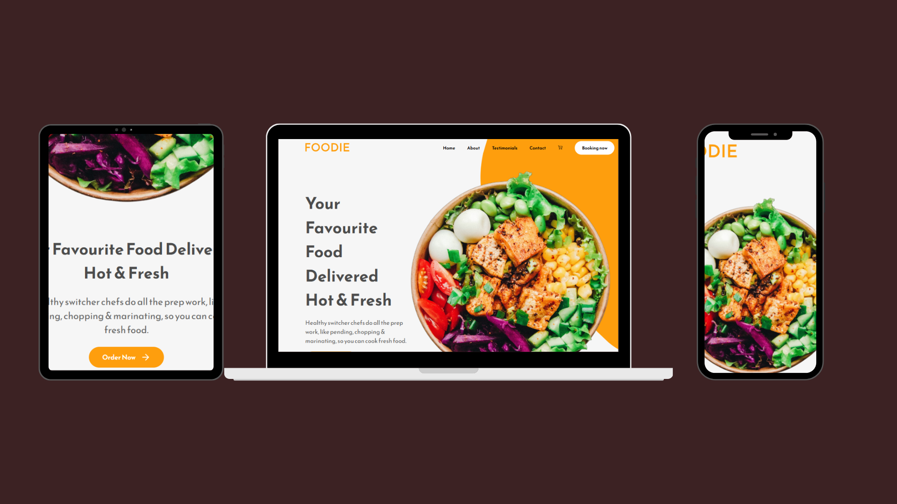

<h1 align="center">Landing page de restaurante - João 👾</h1>

<h4 align="center"><a href="https://jedev1.github.io/Meu-portifolio/">Confira o projeto aqui</a></h4>

---

## 💻 Sobre

Projeto feito no intuito de me apresentar, como desenvolvedor web front-end.

## 🤯 O site é composto por:

- **Home:** Apresentação da loja;
- **Sobre mim:** Falo um pouco sobre a loja o que ela oferece;
- **DSepoimentos:** Os comentários **ficticios** das pessoas sobre a loja;
- **Contato:** Área com meios para contato da loja;
- **Redes:** Redes sociais disponíveis no rodapé do site.

## 🧠 Tecnologias utilizadas:

O site **ainda está em desenvolvimento**, pois estou em constante aprendizado. Mas até aqui utilizei as tecnologias:

## 📚 Alguns conceitos aplicados

Neste projeto apliquei os seguintes pontos:
+ Semântica HTML;
+ Pontos de acessibilidade;
+ Responsividade;
+ Mobile first;

